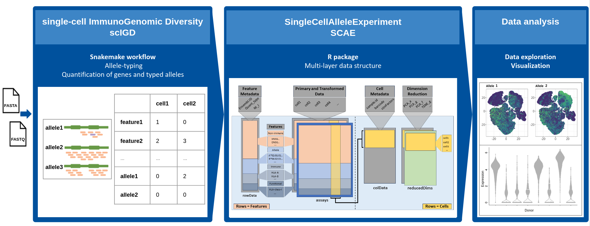
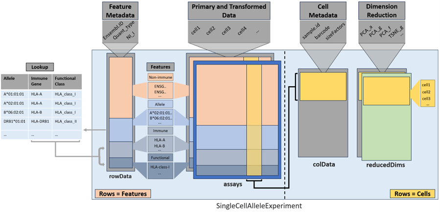

# SingleCellAlleleExperiment

Defines a S4 class that is based on `SingleCellExperiment`. In addition to the usual gene layer, `SingleCellAlleleExperiment` can also store data for immune genes such as HLAs, Immunoglobulins and KIRs at the allele level and at the level of functionally similar groups of immune genes.

# Installation (not part of Bioconductor yet)

`SingleCellAlleleExperiment` and its data package `scaeData` are available in Bioconductor and can be installed as follows:

```markdown
if (!requireNamespace("BiocManager", quietly=TRUE))
    install.packages("BiocManager")

BiocManager::install("scaeData")
BiocManager::install("SingleCellAlleleExperiment")
```

Alternatively, they can be installed from GitHub using the [devtools](https://github.com/r-lib/devtools) package:

```markdown
if (!require("devtools", quietly = TRUE))
    install.packages("devtools")

devtools::install_github("AGImkeller/scaeData", build_vignettes = TRUE)
devtools::install_github("AGImkeller/SingleCellAlleleExperiment", build_vignettes = TRUE)
```

## Biological background and motivation

Immune molecules such as B and T cell receptors, human leukocyte antigens (HLAs) or killer Ig-like receptors (KIRs) are encoded in the genetically most diverse loci of the human genome. Many of these immune genes are hyperpolymorphic, showing high allelic diversity across human populations. In addition, typical immune molecules are polygenic, which means that multiple functionally similar genes encode the same protein subunit. 

However, interactive single-cell methods commonly used to analyze immune cells in large patient cohorts do not consider this. This leads to erroneous quantification of important immune mediators and impaired inter-donor comparability. 

## Workflow for unravelling the immunogenetic diversity in scData

We have developed a workflow, that allows quantification of expression and interactive exploration of donor-specific alleles of different immune genes. The workflow is divided into two software packages and one additional data package: 

1. The **[scIGD](https://github.com/AGImkeller/scIGD)** software package consist of a *[Snakemake](https://snakemake.readthedocs.io/en/stable/)* workflow designed to automate and streamline the genotyping process for immune genes, focusing on key targets such as HLAs and KIRs, and enabling allele-specific quantification from single-cell RNA-sequencing (scRNA-seq) data using donor-specific references. For detailed information of the performed steps and how to utilize this workflow, please refer to its **[documentation](https://github.com/AGImkeller/scIGD)**.

2. To harness the full analytical potential of the results, we've curated a dedicated `R` package, `SingleCellAlleleExperiment` presented in this repository. This package provides a comprehensive multi-layer data structure, enabling the representation of immune genes at specific levels, including alleles, genes, and groups of functionally similar genes and thus, allows data analysis across these immonologically relevant, different layers of annotation.

3. The **[scaeData](https://github.com/AGImkeller/scaeData)** is an `R/ExperimentHub` data package providing three datasets generated and processed by the **[scIGD](https://github.com/AGImkeller/scIGD)** software package which can be used to explore the data and potential downstream analysis workflows using the here presented novel `SingleCellAlleleExperiment` data structure. Refer to **[scaeData](https://github.com/AGImkeller/scaeData)** for more information regarding the datasets and source of raw data. 

This workflow is designed to support both *10x* and *BD Rhapsody* data, encompassing amplicon/targeted sequencing as well as whole-transcriptome-based data, providing flexibility to users working with different experimental setups.




## The `SingleCellAlleleExperiment (SCAE)` class

The `SingleCellAlleleExperiment (SCAE)` class serves as a comprehensive multi-layer data structure, enabling the representation of immune genes at specific levels, including alleles, genes, and groups of functionally similar genes and thus, allows data analysis across these immonologically relevant, different layers of annotation. The implemented data object is derived from the *[SingleCellExperiment (SCE)](https://bioconductor.org/packages/release/bioc/html/SingleCellExperiment.html)* class and follows similar conventions, where rows should represent features (genes, transcripts) and columns should represent cells.

<br>

<div style="text-align: center;">
  
  <br>
  **Figure 2:** Scheme of SingleCellAlleleExperiment object structure with lookup table.
</div>

<br>

For the integration of the relevant additional data layers (see **Figure 2**), the quantification data for alleles, generated by the novel **[scIGD](https://github.com/AGImkeller/scIGD)** software package, is aggregated into two additional data layers via an ontology-based design principle using a lookup table during object generation.

For example, the counts of the alleles `A*01:01:01:01` and `A*02:01:01:01` that are present in the raw input data will be combined into the `HLA-A` immune gene layer. Next, all counts of imune genes corresponding to the `HLA-class I` are combined into the `HLA-class I` functional class layer. See the structure of the used lookup table below.


<div style="margin: 0 auto; width: 50%;">

| Allele       | Gene       | Function    |
| :----------- | :--------- | :---------- |
| A*01:01:01   | HLA-A      | HLA class I |
| A*01:01:01   | HLA-A      | HLA class I |
| ...          | ...        | ...         |
| DRB1*01:01:01| HLA-DRB1   | HLA class II|
</div>

The resulting `SCAE` data object can be used in combination with established single cell packages like *[scater](https://bioconductor.org/packages/release/bioc/html/scater.html)* and *[scran](https://bioconductor.org/packages/release/bioc/html/scran.html)* to perform downstream analysis on immune gene expression, allowing data exploration on functional and allele level. See the vignette for furthter information and insights on how to perform downstream analysis using exemplary data from the accompanying `R/Experimenthub` package **[scaeData](https://github.com/AGImkeller/scaeData)**.


## Citation

To be added..

## Authors 

- [Jonas Schuck](https://github.com/Jonas-Schuck), [Ahmad Al Ajami](https://github.com/ahmadalajami), [Federico Marini](https://github.com/federicomarini), [Katharina Imkeller](https://github.com/imkeller)
