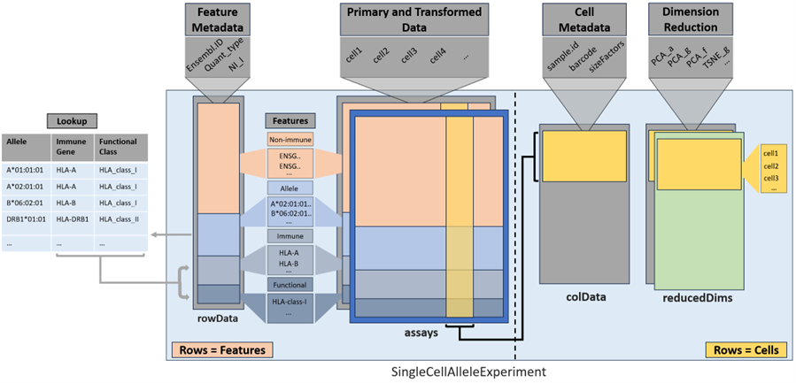

```{r options, include=FALSE, echo=FALSE}
library(BiocStyle)
```

# Introduction

## Biological background and motivation

Immune molecules such as B and T cell receptors, human leukocyte antigens (HLAs) or killer Ig-like
receptors (KIRs) are encoded in the genetically most diverse loci of the human genome. Many of
these immune genes are hyperpolymorphic, showing high allelic diversity across human populations.
In addition, typical immune molecules are polygenic, which means that multiple functionally similar
genes encode the same protein subunit.

We have developed a workflow, that allows quantification of expression and interactive exploration of 
donor-specific alleles of different immune genes. The workflow is composed of three steps: 
1. typing of donor-specific alleles, 
2. quantification of these alleles in single-cell transcriptomic data, 
3. exploration of single-cell transcriptomic data using `SingleCellAlleleExperiment (SCAE)` class. 

The software for steps 1 and 2 can be found in the form of a *Snakemake* workflow named *[scIGD](https://github.com/AGImkeller/scIGD)*. For detailed instructions on utilizing this workflow, please refer to its documentation.

The present repository is dedicated to the implementation of the `SingleCellAlleleExperiment (SCAE)` class. The aim of the here presented
class is to provide an addition to the `SingleCellExperiment (SCE)` object that
can simultaneously contain quantification of alleles, genes, and groups of functionally similar genes
and thus allows data analysis across these immunologically relevant different layers of annotation. 

## The `SingleCellAlleleExperiment (SCAE)` class

The `SingleCellAlleleExperiment (SCAE)` class is a container for storing and handling allele-aware quantification data for immune genes. The SCAE class is derived from the `SingleCellExperiment (SCE)` class and uses the same overall object architecture. However, multiple data layers are integrated into the object during object generation. During object generation, the allele information is aggregated into two additional data layers via an ontology based design principle and appended to the initial raw data using a lookup table. Thus the final `SCAE` object contains quantification of all classical genes ("non-immune genes") and additionally a multi-layer representation of a set of genes of interest (e.g. "immune genes" such as HLAs, Igs, KIRs). For these genes of interest, the quantification is stored on the levels of alleles, genes, and functionally similar groups of genes (refer to Figure 1). 

For example, the counts of the alleles `A*01:01:01:01` and `A*02:01:01:01` that are present in the raw input data will be combined into the `HLA-A` immune gene layer. Next, all counts for the present HLA-class I immune genes will be combined into the `HLA-class I` functional class layer. The information necessary to perform these transformations is saved in a lookup table retrieved from the IPD-IMGT/HLA database and other immunogenetic databases.

The structure of the lookup table that is used for aggregating the allele information into an immune gene layer and from there into functional class layer is as follows:

| Allele         | Gene     | Function      |
| -------------- |:--------:|:------------: |
| A*01:01:01     | HLA-A    | HLA class I   |
| A*01:01:01     | HLA-A    | HLA class I   |
| ...            | ...      | ...           |
| DRB1*01:01:01  | HLA-DRB1 | HLA class II  |

<hr>

The implemented object follows similar conventions like the `SCE` class, where rows should represent features (genes, transcripts) and columns should represent cells. Established single cell packages like `r Biocpkg("scater")` and `r Biocpkg("scran")` can be used with the newly implemented `SCAE` object to perform downstream analysis on immune gene expression. This allows data exploration on functional as well as allele level.


**Figure 1:** Scheme of SingleCellAlleleExperiment object structure with lookup table.

## Expected input

The read in function of the SCAE package `readAlleleCounts()` expects specific files and file identifiers.
The stated input directory should contain the following files:

  - cells_x_genes.barcodes.txt  (list of barcodes/cell identifiers)
  - cells_x_genes.features.txt  (list of feature identifiers)
  - cells_x_genes.mtx           (Contains the quantification matrix)
  - lookup_table.csv            (Info for generating multiple data layers)
    

These identifiers are set as standard values, but can be changed in the corresponding parameters of the `readAlleleCounts()` function in case they are different.

The used dataset for later downstream analysis and testing of the functionalities of the multi-layer object is a dual-center, two-cohort study where whole blood and peripheral blood mononuclear cells underwent scRNA-sequencing. The whole transcriptome dataset is under controlled access and not for public use. The corresponding publication *Severe COVID-19 Is Marked by a Dysregulated Myeloid Cell Compartment* can be found [here](https://www.ncbi.nlm.nih.gov/pmc/articles/PMC7405822/).

# Loading packages 

The following packages are abundant for performing the downstream analysis and visualization.

```{r, message = FALSE}
library(SingleCellAlleleExperiment)
library(scran)
library(scater)
library(tidyverse)
library(patchwork)
library(ggplot2)
```


# Reading in data and quality check

## Stating input directory containing the expected files

First the directory path is stated. The directory should contain all expected files.

```{r}
dir_path <- system.file("extdata", package = "SingleCellAlleleExperiment")
list.files(dir_path)[1:4]
```

## Generate SingleCellAlleleExperiment object

SCAE objects implements the same object architecture as SCE objects. When reading 
allele counts, the method by default filters cells from a knee-plot inflection point.
Alternatively, manual filter settings can be provided.

The `filter` parameter of the `readAlleleCounts` function gives multiple options on how to perform filtering on the cells. The valid parameter options are given as `filter = c("yes", "no", "custom")`. Setting `filter = "yes"` automatically filters the cells on the inflection point that is computed on a knee plot. `filter = "no"` only shows the knee plot without generating a full SCAE object. This mode could be used prior to using `filter = "custom"`, where the user can give a custom threshold for manually filtering out cells in the `filter_threshold` parameter.

Additionally the `verbose` parameter gives an option to toggle runtime-information for the different steps during object generation, which is printed to the console. Messages regarding the filtering process (inflection point threshold) won't be toggled off if `verbose = FALSE`.

The three different modes for filtering and creating a SCAE object are shown in the following code-chunks:

<hr>

Only show the knee plot without generating a SCAE object. All function parameters are shown. Information messages (`verbose = FALSE`) are turned off.

```{r warning=FALSE}
scae <- readAlleleCounts(dir_path,
                         sample_names = "example_data",
                         filter = "no",
                         symbols = "orgdb",
                         exp_type = "WTA",
                         lookup_file = "lookup_table_HLA_only.csv",
                         barcode_file = "cells_x_genes.barcodes.txt",
                         gene_file = "cells_x_genes.genes.txt",
                         matrix_file = "cells_x_genes.mtx",
                         tag_feature_mtx = "cells_x_genes.genes.txt",
                         tag_feature_barcodes = "cells_x_genes.barcodes.txt",
                         filter_threshold = NULL,
                         verbose = FALSE)
```
<br>

Read in and automatic filtering mode, generating a SCAE object. Filtering performed on the computed inflection point on the knee plot.

```{r warning=FALSE}
scae <- readAlleleCounts(dir_path,
                         sample_names = "example_data",
                         filter = "yes",
                         symbols = "orgdb",
                         exp_type = "WTA",
                         verbose = TRUE)
scae
```

<br>

Read in and custom filtering mode, generating a SCAE object. Filtering performed on the threshold stated in the `filter_threshold` parameter.

```{r warning=FALSE}
#this is the object used in the further workflow
scae <- readAlleleCounts(dir_path,
                         sample_names = "example_data",
                         filter = "custom",
                         symbols = "orgdb",
                         exp_type = "WTA",
                         filter_threshold = 105,
                         verbose = FALSE)
scae
```


### RowData slot

Two new classification columns are introduced in the `rowData` slot. Namely the `NI_I` column and `Quant_type` column. Both columns are used to identify each row of the object to its corresponding data layer (see **figure 1**).

```{r}
rowData(scae)
```

### ColData slot

As the object extends the count matrix during the object generation, its abundant to compute scaling factors on the raw data prior to extending and integrating the data layers. The scaling factors are used for scaling normalization in a later step of the SCAE constructor.

```{r}
colData(scae)
```

### Extract information from the different data layers

Additionally to the established `getters` from the SCE package, new getters are implemented to retrieve the different data layers integrated in the SCAE object.

<br>

#### Non-immune genes

```{r}
get_nigenes(scae)

head(rownames(get_nigenes(scae)))
```

<br>

#### Alleles

```{r}
get_alleles(scae)

head(rownames(get_alleles(scae)))
```

<br>

#### Immune genes

```{r}
get_agenes(scae)

head(rownames(get_agenes(scae)))
```

<br>

#### Functional class

```{r}
get_func(scae)

head(rownames(get_func(scae)))
```

<br>

<hr>

# Expression evaluation

Checking the expression for the allele-layer, immune gene layer and functional class layer. Allele identifiers are in the form of `A*02:01:01:01`. The immune genes are in the form of `HLA-A` and the functional classes `HLA_class_I`. Here we see that `HLA_class_I` and `HLA-C` are the most abundant functional class and immune gene respectively, given the underlying dataset.

```{r}
all_alleles <- c(rownames(get_alleles(scae)),
                 rownames(get_agenes(scae)),
                 rownames(get_func(scae)))

plotExpression(scae, all_alleles)
```

<br>

# Downstream analysis

In the following sections, main steps for dimensional reduction are performed, offering insights into the different data layers of the SCAE object as well giving an idea on how to perform immune gene expression analysis. 

## Subsetting the different layers

The non-imune genes are combined with each of the integrated immune gene allele-aware layers to determine three different subsets.

### Non-immune genes + alleles

```{r}
scae_ni_a <- scae[c(rownames(get_nigenes(scae)), rownames(get_alleles(scae))), ]

scae_ni_a
```

<br>

### Non-immune genes + immune genes

```{r}
scae_ni_g <- scae[c(rownames(get_nigenes(scae)), rownames(get_agenes(scae))), ]

scae_ni_g
```

<br>

### Non-immune genes + functional class

```{r}
scae_ni_f <- scae[c(rownames(get_nigenes(scae)), rownames(get_func(scae))), ]

scae_ni_f
```


## Dimensional Reduction


### Model variance and HVGs for all data layers

Using the `modelGeneVar()` function prior to `getTopHVGs`. Both functions are part from the `r Biocpkg("scran")` package. Compute a list of HVGs for each data layer. Return the top 0.1 % HVGs per layer using `getTopHVGs`.

```{r}
df_ni_a <- modelGeneVar(scae_ni_a)
top_ni_a <- getTopHVGs(df_ni_a, prop = 0.1)
```

```{r}
df_ni_g <- modelGeneVar(scae_ni_g)
top_ni_g <- getTopHVGs(df_ni_g, prop = 0.1)
```

```{r}
df_ni_f <- modelGeneVar(scae_ni_f)
top_ni_f <- getTopHVGs(df_ni_f, prop = 0.1)
```

### PCA

Compute PCA for each layer and store the results in the object. Its Important to make unique identifiers for each layer/run or the results will be overwritten and just saved as `PCA`. Here, the `runPCA` functions from the `r Biocpkg("scater")` package is used.

```{r}

set.seed(18)
scae <- runPCA(scae, ncomponents = 10, subset_row = top_ni_a, exprs_values = "logcounts", name = "PCA_a")
scae <- runPCA(scae, ncomponents = 10, subset_row = top_ni_g, exprs_values = "logcounts", name = "PCA_g")
scae <- runPCA(scae, ncomponents = 10, subset_row = top_ni_f, exprs_values = "logcounts", name = "PCA_f")
```

```{r}
reducedDimNames(scae)
```

### t-SNE

The same goes for running t-SNE with the `runTSNE` function from the `r Biocpkg("scater")` package. Unique identifiers are stated here for each layer as well.

```{r}
set.seed(18)
scae <- runTSNE(scae, dimred= "PCA_a",  name = "TSNE_a")
set.seed(18)
scae <- runTSNE(scae, dimred= "PCA_g",  name = "TSNE_g")
set.seed(18)
scae <- runTSNE(scae, dimred= "PCA_f",  name = "TSNE_f")

```

List of results from the performed reduced dimension analysis. 

```{r}
reducedDimNames(scae)
```

<hr>

## Visualization

Exemplary visualization for the t-SNE results on gene level for immune genes that relate to HLA-class I. In the given dataset, these are the immune genes `HLA-A`, `HLA-B` and `HLA-C` plotted alongside their alleles. This allows for insights into potential genetic differences shown on allele-level.


### HLA-A immune gene and alleles

```{r fig3, fig.height = 4, fig.width = 12, fig.align = "center", warning = FALSE, message=FALSE}
which_tsne <- "TSNE_g"

#EGA_hla_a_alleles
tsne_g_a  <- plotReducedDim(scae, dimred = which_tsne, colour_by = "HLA-A") + ggtitle("HLA-A gene")
tsne_g_a1 <- plotReducedDim(scae, dimred = which_tsne, colour_by = "A*02:01:01:01") + ggtitle("Allele A*02:01:01:01")
tsne_g_a2 <- plotReducedDim(scae, dimred = which_tsne, colour_by = "A*26:01:01:01") + ggtitle("Allele A*26:01:01:01")

p2 <- tsne_g_a + tsne_g_a1 + tsne_g_a2

p2
```


### HLA-B immune gene and alleles

```{r fig4, fig.height = 4, fig.width = 12, fig.align = "center", warning = FALSE, message=FALSE}

tsne_g_b  <- plotReducedDim(scae, dimred = which_tsne, colour_by = "HLA-B") + ggtitle("HLA-B gene")
tsne_g_b1 <- plotReducedDim(scae, dimred = which_tsne, colour_by = "B*51:01:01:01") + ggtitle("Allele B*51:01:01:01")
tsne_g_b2 <- plotReducedDim(scae, dimred = which_tsne, colour_by = "B*57:01:01:01") + ggtitle("Allele B*57:01:01:01")

p3 <- tsne_g_b  + tsne_g_b1 + tsne_g_b2

p3
```


### HLA-C immune gene and alleles

```{r fig5, fig.height = 4, fig.width = 12, fig.align = "center", warning = FALSE, message=FALSE}

#EGA_hla_c_alleles 
tsne_g_g  <- plotReducedDim(scae, dimred = which_tsne, colour_by = "HLA-C") + ggtitle("HLA-C gene")
tsne_g_c1 <- plotReducedDim(scae, dimred = which_tsne, colour_by = "C*04:01:01:01") + ggtitle("Allele C*04:01:01:01")
tsne_g_c2 <- plotReducedDim(scae, dimred = which_tsne, colour_by = "C*06:02:01:01") + ggtitle("Allele C*06:02:01:01")

p1 <- tsne_g_g  + tsne_g_c1 + tsne_g_c2 

p1
```

<hr>

# Additional

As the SCAE object is extending the SCE object, it is also compatible with the `r Biocpkg("iSEE")` package for interactive data exploration.


# Session Information

```{r}
sessionInfo()
```
