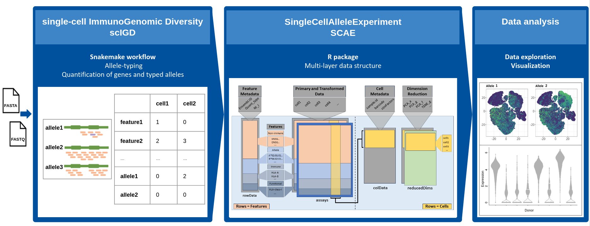

```{r options, include=FALSE, echo=FALSE}
if (!require("BiocManager", quietly=TRUE))
    install.packages("BiocManager")

BiocManager::install("BiocStyle")
library(BiocStyle)
```

# Installation

From Bioconductor:

```{r, eval=FALSE}
if (!require("BiocManager", quietly=TRUE))
    install.packages("BiocManager")

BiocManager::install("SingleCellAlleleExperiment")
```


# Introduction to the workflow

## Biological background and motivation

Immune molecules such as B and T cell receptors, human leukocyte antigens (HLAs) or killer Ig-like receptors (KIRs) are encoded in the genetically most diverse loci of the human genome. Many of these immune genes are hyperpolymorphic, showing high allelic diversity across human populations. In addition, typical immune molecules are polygenic, which means that multiple functionally similar genes encode the same protein subunit. 

However, interactive single-cell methods commonly used to analyze immune cells in large patient cohorts do not consider this. This leads to erroneous quantification of important immune mediators and impaired inter-donor comparability. 

## Workflow for unravelling the immunogenetic diversity in scData

We have developed a workflow, that allows quantification of expression and interactive exploration of donor-specific alleles of different immune genes. The workflow is divided into two software packages and one additional data package: 

1. The **[scIGD](https://github.com/AGImkeller/scIGD)** software package consist of a *[Snakemake](https://snakemake.readthedocs.io/en/stable/)* workflow designed to automate and streamline the genotyping process for immune genes, focusing on key targets such as HLAs and KIRs, and enabling allele-specific quantification from single-cell RNA-sequencing (scRNA-seq) data using donor-specific references. For detailed information of the performed steps and how to utilize this workflow, please refer to its **[documentation](https://github.com/AGImkeller/scIGD)**.

2. To harness the full analytical potential of the results, we've developed a dedicated `R` package, `SingleCellAlleleExperiment` presented in this repository. This package provides a comprehensive multi-layer data structure, enabling the representation of immune genes at specific levels, including alleles, genes, and groups of functionally similar genes and thus, allows data analysis across these immonologically relevant, different layers of annotation.

3. The **[scaeData](https://github.com/AGImkeller/scaeData)** is an `R/ExperimentHub` data package providing datasets generated and processed by the **[scIGD](https://github.com/AGImkeller/scIGD)** software package which can be used to explore the data and potential downstream analysis workflows using the here presented novel `SingleCellAlleleExperiment` data structure. Refer to **[scaeData](https://github.com/AGImkeller/scaeData)** for more information regarding the available datasets and source of raw data. 

This workflow is designed to support both **10x** and **BD Rhapsody** data, encompassing amplicon/targeted sequencing as well as whole-transcriptome-based data, providing flexibility to users working with different experimental setups.


**Figure 1:** Overview of the scIGD workflow for unraveling immunogenomic diversity in single-cell data, highlighting the integration of the SingleCellAlleleExperiment package for comprehensive data analysis.

# Introduction to the `SingleCellAlleleExperiment (SCAE)` class

The `SingleCellAlleleExperiment (SCAE)` class serves as a comprehensive multi-layer data structure, enabling the representation of immune genes at specific levels, including alleles, genes, and groups of functionally similar genes and thus, allows data analysis across these immonologically relevant, different layers of annotation. The implemented data object is derived from the *[SingleCellExperiment (SCE)](https://bioconductor.org/packages/release/bioc/html/SingleCellExperiment.html)* class and follows similar conventions, where rows should represent features (genes, transcripts) and columns should represent cells.

<br>

<div style="text-align: center;">
  
</div>

**Figure 2:** Scheme of SingleCellAlleleExperiment object structure with lookup table.

<br>

For the integration of the relevant additional data layers (see **Figure 2**), the quantification data for alleles, generated by the novel **[scIGD](https://github.com/AGImkeller/scIGD)** software package, is aggregated into two additional data layers via an ontology-based design principle using a lookup table during object generation.

For example, the counts of the alleles `A*01:01:01:01` and `A*02:01:01:01` that are present in the raw input data will be combined into the `HLA-A` immune gene layer (see **Table 1** below). Next, all counts of imune genes corresponding to `HLA-class I` are combined into the `HLA-class I` functional class layer. See the structure of the used lookup table below.

<br>

**Table 1:** Scheme of the lookup table used to aggregate allele information into multiple data layers.

<div style="margin: 0 auto; width: 50%;">

| Allele       | Gene       | Function    |
| :----------- | :--------- | :---------- |
| A*01:01:01   | HLA-A      | HLA class I |
| A*01:01:01   | HLA-A      | HLA class I |
| ...          | ...        | ...         |
| DRB1*01:01:01| HLA-DRB1   | HLA class II|
</div>

<br>

The resulting `SCAE` data object can be used in combination with established single cell analysis packages like *[scater](https://bioconductor.org/packages/release/bioc/html/scater.html)* and *[scran](https://bioconductor.org/packages/release/bioc/html/scran.html)* to perform downstream analysis on immune gene expression, allowing data exploration on functional and allele level. See the vignette for furthter information and insights on how to perform downstream analysis using exemplary data from the accompanying `R/Experimenthub` package **[scaeData](https://github.com/AGImkeller/scaeData)**.

## Expected input and dataset description

The read in function of the SCAE package `read_allele_counts()` expects specific files that are generated by the previous steps of the workflow, performed in the **[scIGD](https://github.com/AGImkeller/scIGD)** package. One input parameter needs to state the path to a directory containing all the input files. The file identifiers can be
specifically stated as parameters. The default file identifiers, as they are outputted from **scIGD** are listed below:
The stated input directory should contain the following files:

- **cells_x_genes.barcodes.txt**  (list of barcodes/cell identifiers)
- **cells_x_genes.features.txt** (list of feature identifiers)
- **cells_x_genes_mtx.mtx**      (Contains the quantification matrix)
- **lookup_table.csv**            (Info for generating multiple data layers)
    

The dataset used for the here shown downstream analysis is taken from the accompanying data package **[scaeData](https://github.com/AGImkeller/scaeData)**. Specifically we are using the `pbmc_10k` dataset. Utilizing the `demo_scae()` function available in this package. The corresponding raw data for can be found here: [10XGenomics](https://www.10xgenomics.com/datasets?query=&page=1&configure%5BhitsPerPage%5D=50&configure%5BmaxValuesPerFacet%5D=1000)

---**delete the following once the package is updated and is able to use the scaeData package**---

The used dataset for later downstream analysis and testing of the functionalities of the multi-layer object is a dual-center, two-cohort study where whole blood and peripheral blood mononuclear cells underwent scRNA-sequencing. The whole transcriptome dataset is under controlled access and not for public use. The corresponding publication *Severe COVID-19 Is Marked by a Dysregulated Myeloid Cell Compartment* can be found [here](https://www.ncbi.nlm.nih.gov/pmc/articles/PMC7405822/).

<hr>

# Exemplary downstream analysis 

## Loading packages 

The following packages are abundant for performing the here stated downstream analysis and visualization.

```{r, message = FALSE, echo=FALSE}
if (!require("BiocManager", quietly=TRUE))
    install.packages("BiocManager")

if (!require("scran", quietly=TRUE))
    BiocManager::install("scran")
if (!require("scater", quietly=TRUE))
    BiocManager::install("scater")
if (!require("patchwork", quietly=TRUE))
    BiocManager::install("patchwork")
if (!require("ggplot2", quietly=TRUE))
    BiocManager::("ggplot2")

```

```{r, message = FALSE}
library(scran)
library(scater)
library(patchwork)
library(ggplot2)
library(SingleCellAlleleExperiment)
```


## Reading in data and performing quality check

### **IMPORTANT NOTE FOR USERS**

----**this is relevant once the package is updated and using the scaeData package instead of internal data**---

For your normal analysis the read in function `read_allele_counts()` is the function you use to read in your data and generate a `SCAE` object. To be able to successfully perform this, you need to state the **path to the directory containing all expected input files** and pass it to the `dir_path` parameter.

Example code to showcase this:

```markup
dir_path <- "path/to/input/files/"
list.files(dir_path)
```
The path should contain the following files:
 
 - **"cells_x_genes.barcodes.txt" "cells_x_genes.genes.txt" "cells_x_genes.mtx" "lookup_table.csv"**

If the identifiers are different, state the new file names in the parameters `barcode_file = ""`, `gene_file = ""`, `matrix_file = ""`, `lookup_file = ""`. And then run the `read_allele_counts()` function to generate your SCAE object.

**However**, in this vignette we are utilizing the `demo_scae()` function, which has overall the same parameters as the `read_allele_counts()` function but utilizes datasets extracted from the accompanying Experimenthub package `scaeData` and thus, stating a directory path to the files on your machine is not needed. Information and parameters for the different **filtering modes** is the same in both functions, and can be utilized like stated in the steps showcased below.

### Stating input directory containing the expected files

---**The whole section needs to be changed to using a new main function (`demo_scae()`) once the package is updated and uses the scaeData package instead of internal data**---

State the path to the directory containing all expected input files.

```{r}
dir_path <- system.file("extdata", package = "SingleCellAlleleExperiment")
list.files(dir_path)[1:5]
```

### Generate SingleCellAlleleExperiment object

This is an essential step. The read in function `read_allele_counts()` is the function you use to read in your data and generate a `SCAE` object.


It also provides multiple parameters to perform filtering steps on the cells contained in your data. For this, **multiple parameter combinations are possible and showcased below.** Filtering is performed on a [**knee plot**](https://liorpachter.wordpress.com/tag/knee-plot/).

The first parameter, where you state which **filter mode** you want to use, gives the following valid options: `filter = c("yes", "no", "custom")`.

  - `filter = "no"`: Shows a knee plot for determining a potential threshold for filtering by yourself. **No SCAE object will be generated**.
  - `filter = "yes"` : Automatically filters the cells on the inflection point of the computed knee plot and generates a SCAE object.
  - `filter = "custom"` : The user can give a custom threshold for manually filtering cells, which is different than the automatically computed one in `filter = "yes"`. State your custom threshold as an integer in the `filter_threshold` parameter.
  
Additionally, the `verbose` parameter gives you an option to toggle runtime-information for the different steps during object generation. Messages regarding the filtering process (suggested inflection point threshold) will not be toggled off if `verbose = FALSE`.

**The process of performing the three different filter-modes an generating a SCAE object are shown in the following code-chunks:**

<hr>

#### `filter = "no"`

Only show the knee plot without generating a SCAE object. All function parameters are shown. Information messages (`verbose = FALSE`) are turned off.

```{r warning=FALSE}
scae <- read_allele_counts(dir_path,
                           sample_names = "example_data",
                           filter = "no",
                           exp_type = "WTA",
                           lookup_file = "lookup_table_HLA_only.csv",
                           barcode_file = "cells_x_genes.barcodes.txt",
                           gene_file = "cells_x_genes.genes.txt",
                           matrix_file = "cells_x_genes.mtx",
                           tag_feature_mtx = "cells_x_genes.genes.txt",
                           tag_feature_barcodes = "cells_x_genes.barcodes.txt",
                           filter_threshold = NULL,
                           verbose = FALSE)
```

#### `filter = "yes"`

Automatic filtering mode and generation of a SCAE object. Filtering is performed on the computed inflection point of the knee plot.

```{r warning=FALSE}
scae <- read_allele_counts(dir_path,
                         sample_names = "example_data",
                         filter = "yes",
                         exp_type = "WTA",
                         verbose = TRUE)
scae
```

#### `filter = "custom"`

Custom filtering mode and generation of a SCAE object. Filtering performed on the threshold stated in the `filter_threshold` parameter.

```{r warning=FALSE}
#this is the object used in the further workflow
scae <- read_allele_counts(dir_path,
                         sample_names = "example_data",
                         filter = "custom",
                         exp_type = "WTA",
                         filter_threshold = 105,
                         verbose = FALSE)
scae
```


### Showcasing different object slots

#### RowData slot

Two new classification columns are introduced in the `rowData` slot. Namely the `NI_I` column and `Quant_type` column. Both columns are used to identify each row of the object to its corresponding data layer (see **figure 1**).

```{r}
rowData(scae)
```

#### ColData slot

As the object extends the count matrix during the object generation, its abundant to compute scaling factors on the raw data prior to extending and integrating the data layers. The scaling factors are used for scaling normalization in a later step of the SCAE constructor.

```{r}
colData(scae)
```

### Extract information from the different data layers

Additionally to the established `getters` from the SCE package, new getters are implemented to retrieve the different data layers integrated in the SCAE object.

<br>

#### Non-immune genes

```{r}
get_nigenes(scae)

head(rownames(get_nigenes(scae)))
```

<br>

#### Alleles

```{r}
scae_subset_alleles(scae)

head(rownames(scae_subset_alleles(scae)))
```

<br>

#### Immune genes

```{r}
get_agenes(scae)

head(rownames(get_agenes(scae)))
```

<br>

#### Functional class

```{r}
scae_subset_functional(scae)

head(rownames(scae_subset_functional(scae)))
```

<br>

<hr>

## Expression evaluation

Checking the expression for the allele-layer, immune gene layer and functional class layer. Allele identifiers are in the form of `A*02:01:01:01`. The immune genes are in the form of `HLA-A` and the functional classes `HLA_class_I`. Here we see that `HLA_class_I` and `HLA-C` are the most abundant functional class and immune gene respectively, given the underlying dataset.

```{r}
all_alleles <- c(rownames(scae_subset_alleles(scae)),
                 rownames(get_agenes(scae)),
                 rownames(scae_subset_functional(scae)))

plotExpression(scae, all_alleles)
```

<br>

# Downstream analysis

In the following sections, main steps for dimensional reduction are performed, offering insights into the different data layers of the SCAE object as well giving an idea on how to perform immune gene expression analysis. 

## Subsetting the different layers

The non-imune genes are combined with each of the integrated immune gene allele-aware layers to determine three different subsets.

### Non-immune genes + alleles

```{r}
scae_ni_a <- scae[c(rownames(get_nigenes(scae)), rownames(scae_subset_alleles(scae))), ]

scae_ni_a
```

<br>

### Non-immune genes + immune genes

```{r}
scae_ni_g <- scae[c(rownames(get_nigenes(scae)), rownames(get_agenes(scae))), ]

scae_ni_g
```

<br>

### Non-immune genes + functional class

```{r}
scae_ni_f <- scae[c(rownames(get_nigenes(scae)), rownames(scae_subset_functional(scae))), ]

scae_ni_f
```


## Dimensional Reduction


### Model variance and HVGs for all data layers

Using the `modelGeneVar()` function prior to `getTopHVGs`. Both functions are part from the `r Biocpkg("scran")` package. Compute a list of HVGs for each data layer. Return the top 0.1 % HVGs per layer using `getTopHVGs`.

```{r}
df_ni_a <- modelGeneVar(scae_ni_a)
top_ni_a <- getTopHVGs(df_ni_a, prop = 0.1)
```

```{r}
df_ni_g <- modelGeneVar(scae_ni_g)
top_ni_g <- getTopHVGs(df_ni_g, prop = 0.1)
```

```{r}
df_ni_f <- modelGeneVar(scae_ni_f)
top_ni_f <- getTopHVGs(df_ni_f, prop = 0.1)
```

### PCA

Compute PCA for each layer and store the results in the object. Its Important to make unique identifiers for each layer/run or the results will be overwritten and just saved as `PCA`. Here, the `runPCA` functions from the `r Biocpkg("scater")` package is used.

```{r}

set.seed(18)
scae <- runPCA(scae, ncomponents = 10, subset_row = top_ni_a, exprs_values = "logcounts", name = "PCA_a")
scae <- runPCA(scae, ncomponents = 10, subset_row = top_ni_g, exprs_values = "logcounts", name = "PCA_g")
scae <- runPCA(scae, ncomponents = 10, subset_row = top_ni_f, exprs_values = "logcounts", name = "PCA_f")
```

```{r}
reducedDimNames(scae)
```

### t-SNE

The same goes for running t-SNE with the `runTSNE` function from the `r Biocpkg("scater")` package. Unique identifiers are stated here for each layer as well.

```{r}
set.seed(18)
scae <- runTSNE(scae, dimred= "PCA_a",  name = "TSNE_a")
set.seed(18)
scae <- runTSNE(scae, dimred= "PCA_g",  name = "TSNE_g")
set.seed(18)
scae <- runTSNE(scae, dimred= "PCA_f",  name = "TSNE_f")

```

List of results from the performed reduced dimension analysis. 

```{r}
reducedDimNames(scae)
```

<hr>

## Visualization

Exemplary visualization for the t-SNE results on gene level for immune genes that relate to HLA-class I. In the given dataset, these are the immune genes `HLA-A`, `HLA-B` and `HLA-C` plotted alongside their alleles. This allows for insights into potential genetic differences shown on allele-level.


### HLA-A immune gene and alleles

```{r fig3, fig.height = 4, fig.width = 12, fig.align = "center", warning = FALSE, message=FALSE}
which_tsne <- "TSNE_g"

#EGA_hla_a_alleles
tsne_g_a  <- plotReducedDim(scae, dimred = which_tsne, colour_by = "HLA-A") + ggtitle("HLA-A gene")
tsne_g_a1 <- plotReducedDim(scae, dimred = which_tsne, colour_by = "A*02:01:01:01") + ggtitle("Allele A*02:01:01:01")
tsne_g_a2 <- plotReducedDim(scae, dimred = which_tsne, colour_by = "A*26:01:01:01") + ggtitle("Allele A*26:01:01:01")

p2 <- tsne_g_a + tsne_g_a1 + tsne_g_a2

p2
```


### HLA-B immune gene and alleles

```{r fig4, fig.height = 4, fig.width = 12, fig.align = "center", warning = FALSE, message=FALSE}

tsne_g_b  <- plotReducedDim(scae, dimred = which_tsne, colour_by = "HLA-B") + ggtitle("HLA-B gene")
tsne_g_b1 <- plotReducedDim(scae, dimred = which_tsne, colour_by = "B*51:01:01:01") + ggtitle("Allele B*51:01:01:01")
tsne_g_b2 <- plotReducedDim(scae, dimred = which_tsne, colour_by = "B*57:01:01:01") + ggtitle("Allele B*57:01:01:01")

p3 <- tsne_g_b  + tsne_g_b1 + tsne_g_b2

p3
```


### HLA-C immune gene and alleles

```{r fig5, fig.height = 4, fig.width = 12, fig.align = "center", warning = FALSE, message=FALSE}

#EGA_hla_c_alleles 
tsne_g_g  <- plotReducedDim(scae, dimred = which_tsne, colour_by = "HLA-C") + ggtitle("HLA-C gene")
tsne_g_c1 <- plotReducedDim(scae, dimred = which_tsne, colour_by = "C*04:01:01:01") + ggtitle("Allele C*04:01:01:01")
tsne_g_c2 <- plotReducedDim(scae, dimred = which_tsne, colour_by = "C*06:02:01:01") + ggtitle("Allele C*06:02:01:01")

p1 <- tsne_g_g  + tsne_g_c1 + tsne_g_c2 

p1
```

<hr>

# Additional

As the SCAE object is extending the SCE object, it is also compatible with the `r Biocpkg("iSEE")` package for interactive data exploration.


# Session Information

```{r}
sessionInfo()
```
